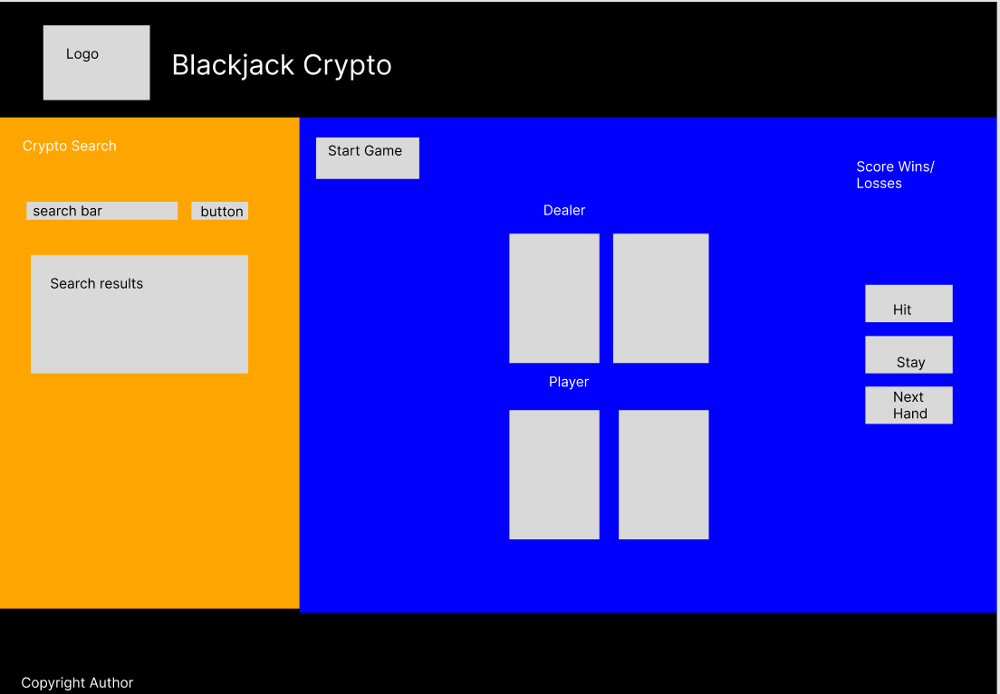

# SDI-Project-1
Problem statement: Creating a website where someone can come and play a few games of blackjack while also monitoring the top 10 crypto currencies.

# Blackjack Crypto

Blackjack Crypto is more than just a game website! Sure, it's a place where anyone can come play or practice some hands of blackjack, but you can also monitor the top 10 crypto currencies. You can beat the dealer, then beat the market with up-to-date information!

## Blackjack Instructions
1. To start the game, press the **START NEW GAME** button.
      * The **NEXT HAND** button will become visible.
      * Press teh **NEXT HAND** button and you will be presented with two cards face up and the dealer will present a card face down and one face up.
2. Next, make a choice if you want to hit or stay based on your score.
      * Remember you are trying to get as close to 21 as possible without going over, otherwise you **bust** and you **lose**!
3. If you would like another card, press the **HIT** button.
      * Your score will increment and hopefully you have not **BUSTED!!**
4. If or when you like your score, press the **STAY** button.
      * This will cause the dealer to reveal their face down card. If their score is less than 17, they will hit again and continue to hit until they bust or reach a score between 17 and 21.
5. If your score is higher than the dealer's score or the dealer has gone over 21, **YOU WIN!!** However, if the dealer's score is higher than your score or you went over 21, **YOU LOSE!!**
6. If you want to play again, simply press the **NEXT HAND** button and the game will restart and the dealer will keep track of your wins and losses!
      * If you happen to run out of cards, simply press teh **START NEW GAME** button and then **NEXT HAND** to keep on playing.

## Crypto Instructions
You are able to search for a specific coin and you will be given the name of the coin, the stock symbol, the current price, and the 24-hour percentage change in price. To do so:
1. Simply click in the search area and type in the name of the coin you wish to research.
2. You can either then press the **ENTER** key or you can click the **FIND COIN** button.
3. You will then be presented with a table with the above mentioned stats displayed.
4. To search for a different coin, simply type the new coin name in the search bar and press **ENTER** or click **FIND COIN**.

You will also notice a ticker scrolling across the top of the screen which is displaying the current top 10 crypto currencies. The information being presented to you is the same as what will be displayed in the search area. There is nothing you need to do but watch and enjoy the information being presented to you!

## Wireframe
Below was the concept of the website during the planning stages.

## Kaban Board

Follow this link to view my [Kaban](https://trello.com/b/hgI3Bp42/sdi-project-1) board.
